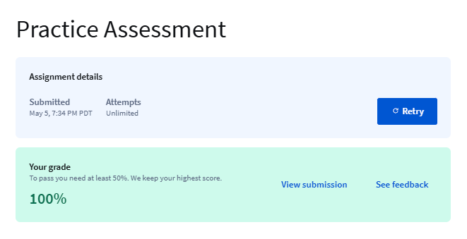

# Module 3 - Machine Learning Image Classification

# Introduction to Image Classification

Image classification is the process of taking an image or picture and getting a computer to automatically classify it, or try to provide the probability of the class of the image

- A class is essentially a label, for instance: cat, car, building, and so on

Due to the challenges of classifying images, this module reviews several machine learning supervised methods for image classification. K-Nearest Neighbours, feature extraction, linear classifiers

# Image Classification with K-Nearest Neighbours (KNN)

KNN classifies the unknown data points by finding the most common classes in the k-nearest examples

- sk-learn is a library in Python that can be used to create KNN models

Separating data into training and testing sets is an important part of model evaluation. We use the test data to get an idea of how our model will perform in the real world. When we split a data set, usually the larger portion of the data is used for training and a smaller part is used for testing. For example, we can use 70% of the data for training and use 30% for testing.

 We use a training set to build a model, and a testing set to evaluate model performance

# Linear Classifiers

A linear classifier is a type of machine learning algorithm that makes its predictions based on a linear combination of input features.

- Linear classifiers are widely used in classification, and they are the building blocks of more advanced classification methods

# Logistic Regression Training: Gradient Descent

Logistic regression is a linear classifier used for binary classification (e.g., yes/no, spam/not spam). Instead of directly predicting a class, it outputs a probability between 0 and 1 using the sigmoid function.

- Gradient Descent is an optimization algorithm used to find the minimum of a function — typically a loss function in machine learning

# Logistic Regression with Mini-Batch Gradient Descent

Completed Lab; attached to module

# SoftMax and Multi-Class Classification

Review of argmax function: The argmax function returns the index corresponding to the largest value in a sequence of numbers.

Softmax classification is a method used in multi-class classification problems — where you want to classify inputs into more than two categories.

Instead of just predicting the "best" class, the softmax function outputs a probability distribution over all possible classes. The class with the highest probability is selected as the prediction.

- Training for SoftMax is almost identical to logistic regression

# **Hand-written Digits Image Classification with Softmax**

Completed Lab; attached to module

# Support Vector Machines

SVMs are based on the idea of finding a plane that best divides a dataset into two classes

- A dataset is linearly separable if we can use a plane to separate each class, but not all data sets are linearly separable
- SVMs try to find a hyperplane that can separate classes
    - Uses a kernel function to do this efficiently
        - Different types such as: Linear, Polynomial, Radial basis function (RBF) - widely used
    - When the classes are not separable the soft margin SVM can be used

# Support Vector Machines vs Vanilla Linear Classifier

Completed Lab; attached to module

# Image Features

- Classifying an image involves the relationship between pixels; a slight change in the image affects this relationship
- Features are measurements taken from the image that help with classification
- Histograms only count intensities and do not consider the relationships between pixels

H.O.G stands for Histogram of Oriented Gradients

- Uses the gradient orientation of the localised regions of an image
- H.O.G generates a histogram for each localised region

HOG breaks the image into small regions, computes the direction of edges (gradients) in each region, and builds a histogram of these directions. These histograms describe the appearance and shape of the object.

# Practice Assessment Completion

# ChatGPT Q&A

[https://chatgpt.com/share/6819762b-3b54-8001-978b-e885dd3a41b7](https://chatgpt.com/share/6818ae99-5ed4-8001-ba28-3af775924913)