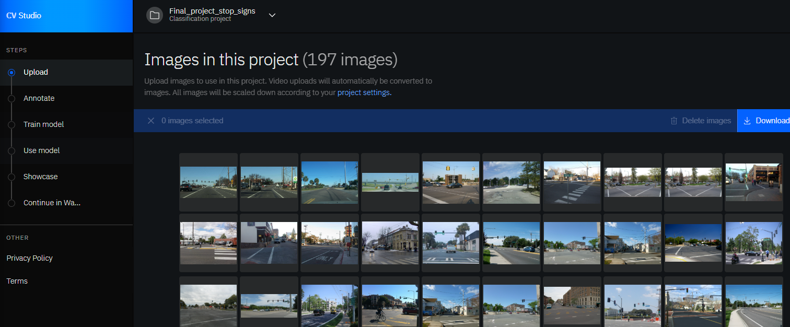

# Module 6 - Project Case: Traffic Sign Classification

In this project we are tasked with building a model that can identifgy traffic signs for usage with cars

The tasks are as follows:

1. Gather and Upload Data
2. Train Classifier
3. Deploy Model
4. Test Classifier

# Gathering and Uploading Data

We receive and upload two folders

- Stop: Contains pictures of stop signs
- not_stop: Pictures without stop signs, regular pictures of the road

# Train Classifier

This model is trained using a standard supervised learning approach over multiple epochs. For each epoch, it loops through batches of training data, performing forward propagation, computing the loss using a given loss function, backpropagating the error, and updating model weights via the optimizer. After each epoch, it evaluates performance on a separate validation set to calculate accuracy. A learning rate scheduler adjusts the learning rate at each epoch, and the model’s best-performing state (based on validation accuracy) is saved and restored at the end of training. Loss and accuracy are recorded over epochs to track learning progress.

# Deploy Model

We deploy the model with the following configurations

# Test Classifier

Finally, we see the following predicitions made by the classifier

