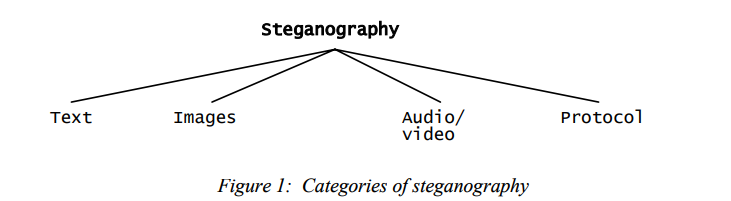

# Research Paper #1 - ‘An Overview of Image Steganography’

**Learning Objectives:**

- Understand the foundational principles of image steganography
- Identify the key requirements of a robust steganographic algorithm
- Create a summary of notes for reference

# Introduction

**What is Steganography?**

- The art of hiding the fact that communication is taking place, by hiding information in other information”
- Digital Images are the most popular forms of hiding information within, due to their popularity on the internet
- There exists a variety of steganographic techniques

**Addressing the need for steganography**

- It may not be enough to keep the contents of a message secret, it may also be necessary to keep the message itself a secret. This is the difference between Cryptography and Steganography. Using both techniques can amplify the secrecy of the message
- To ‘break’ steganography, one needs to observe that there is information hidden in a file

**Related Technologies**

- Watermarking
- Fingerprinting

# Overview

**Different Kinds of Steganography**

- The formats where steganography works the greatest are those with a high degree of redundancy - the bits of an object that can be altered without being detected too easily
    - Image and audio files are examples of this

## Image Steganography

- Image Steganography can be divided into 2 groups:
    - Image Domain - embed messages in the intensity of the pixels directly
    - Transform Domain - Images are first transformed and then the message is embedded in the image

**Summary of Methods** 

- **Image Domain**
    - Least Significant Bits (LSB): The least significant bit (the 8th bit) of the image is changed to a bit of the secret message
- **Transform Domain**
    - JPEG Compression/Steganography: Embeds hidden data in the least significant bits of Discrete Cosine Transform coefficients - Difficult to detect but complex to implement
- **Image or Transform Domain**
    - Patchwork: Statistical technique that embeds a message in an image by brightening and darkening certain areas of an image
    - Spread Spectrum: technique where the message is embedded in noise and then combined with the original image to produce the stego image

The table below summarises the effectiveness of each method according to each criterion

# References

Morkel, T., Eloff, J. H. P., & Olivier, M. S. (2005). An overview of image steganography. *Proceedings of the ISSA 2005 New Knowledge Today Conference, 29 June - 1 July 2005, Balalaika Hotel, Sandton, South Africa*, 1–11. https://www.researchgate.net/publication/220803240_An_overview_of_image_steganography

# ChatGPT Q&A Transcript

[https://chatgpt.com/share/67d23f59-4e6c-8001-a60c-1373ced97f67](https://chatgpt.com/share/67d23f59-4e6c-8001-a60c-1373ced97f67)