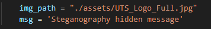

# Steganography Explanation and Code Examples - Least Significant Bit Replacement

In this module, we learn about the encoding and decoding process for messages embedded into images

This course works off modules provided by Samuel Chan (onlyphantom) on GitHub. Resources for this course (including the encode and decode scripts) can be found here: [https://github.com/onlyphantom/steganography](https://github.com/onlyphantom/steganography)

For this module, we attempt to embed a message into a .jpg image with an encoding script and output the resultant stego-image. The message can then later be extracted from the stego-image with a decoding script. This process can effectively be used to simulate covert communications between two or more entities, provided that the parties involved are aware of the stegoimage and also possess the ability to encode and decode messages

# Encoding Script

The provided Python script performs image-based steganography by embedding a secret message into a `.jpg` image using Least Significant Bit (LSB) encoding. Specifically, it modifies the two least significant bits of each colour channel in the image to conceal message data, distributing each character across multiple pixels to preserve visual fidelity. The message is prefixed with its length and a delimiter to aid in later extraction. The modified image is then saved as a new file with the hidden message embedded, appearing visually unchanged to the human eye.

## Core Functions

- insert(): embeds a message into the image
    - Loads the image and saves its shape for reconstruction later
    - Checks the byte capacity of the message to ensure the message will fit
    - Flattens the image to 1D and encodes each character over 4 bytes
    - Reshapes the modified data back to the original image dimensions and saves it
- encode(): writes a character into a pixel block
    - Each character (8 bits) is split across 4 bytes

# Decoding Script

The decoding script extracts the message that was hidden in the least significant bits of an image. The script flattens the image again and reads the values; every 4 bytes will contain one character of the message. The script continues to read until it reaches the `%` symbol that tells the script to stop reading.

## Core Functions

- extract(): read and extract the message from the image
    - Load the image and flatten the pixel data
    - Read the message length
    - Reach each chunk of 4 bytes, decode it to a character, and keep storing it to a variable until the full message is retrieved
- decode(): Convert 4 LSB-encoded image bytes into 1 readable character

NOTE: These scripts are the work of Samuel Chan (onlyphantom) on Github. This resource is purely for learning and understanding

# Example

For this example, we will embed a hidden message into the UTS logo. The reference image is provided here


In our main method, we specify the file path for the UTS logo and also specify the message we would like to embed



We run the script and observe the output image. Visually, the images are identical, however, with the only difference being that the resultant image contains the message that we embedded. This can be seen reflected in the file sizes of the images (unaltered - 76kb, altered - 117kb)


Now we use the decode script to retrieve the original message. We have to pass the file path of the altered image


As can be seen, we have retrieved the hidden message with the decode script.

# Chatgpt Q&A

*Q: What does it mean when each character is encoding over 4 bytes?
A:* 

### Here's what's happening in simple terms:

Each **character** in your message (like `'H'` or `'i'`) is:

1. Converted into **8 bits** (e.g., `'H'` → `01001000`)
2. Those 8 bits are **split into four chunks of 2 bits each**
3. Each 2-bit chunk is **hidden inside 1 byte of the image**

> So yes — 1 character is stored across 4 bytes of the image.
> 

---

### Visual Example:

Let’s say you're hiding the letter **'A'**:

- ASCII value of `'A'` is `65` → binary: `01000001`
- Split into four 2-bit chunks: `01`, `00`, `00`, `01`

These chunks are then stored in the **last 2 bits** of 4 separate image bytes:

```
arduino
CopyEdit
Image byte 1: XX...XX01
Image byte 2: XX...XX00
Image byte 3: XX...XX00
Image byte 4: XX...XX01
```

(Where `XX...XX` means the rest of the byte is unchanged)

---

### Why this works:

Changing just the last 2 bits of each color value (like Red, Green, Blue) makes such a tiny change that it’s invisible to the human eye — but your code knows how to find and decode it later.